# Kubernetes
## Crear un clúster

1. Tener descargado minikube (instancia lightweight de kubernetes)
2. Correr
```
minikube start
```
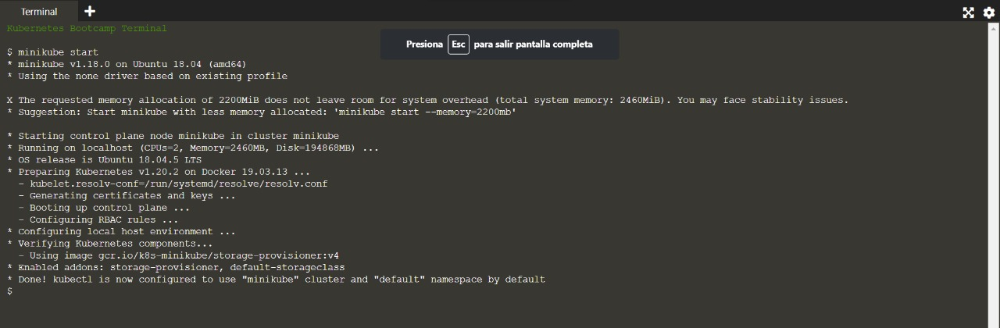

3. Ahora hay un cluster de Kubernetes corriendo en una VM creada por Minikube. Para interactuar con él es necesario instalar kubectl.

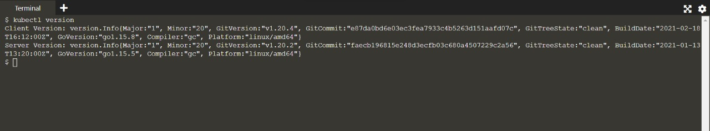

## Desplegar una app
1. Correr ```kubectl create deployment``` indicando la localización de la imagen a correr

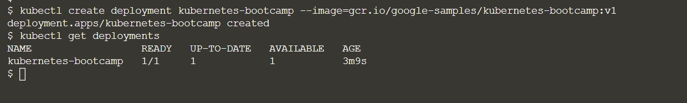

2. Correr ```kubectl proxy``` para crear un proxy que permite la comunicación dentro de la red privada.


3. Obtener el nombre del Pod y guardarlo en una variable de entorno ```POD_NAME``` corriendo el comando 
```
export POD_NAME=$(kubectl get pods -o go-template --template '{{ange .items}}{{.metadata.name}}{{"\n"}}{{end}}')
```


4. Acceder al Pod a través de la API corriendo 
```
curl http://localhost:8001/api/v1/namespaces/default/pods/$POD_NAME/
```


## Troubleshoot
- Para listar distintas cosas se usa el comando ```get``` (por ejemplo, ```kubectl get nodes``` para ver los nodos o kubectl get deployments para ver los despliegues).

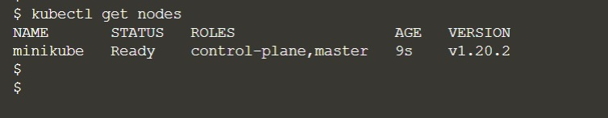

- Para ver los containers dentro de un Pod se utiliza el comando
```
kubectl describe pods
```


- Para ver todo lo que la aplicación mandaría a STDOUT se usa
```
kubectl logs $POD_NAME
```
- Para ejecutar comandos en el container una vez que el Pod está corriendo, se utiliza ```exec``` (por ejemplo, ```kubectl exec -ti $POD_NAME -- bash``` para abrir un bash dentro del container)

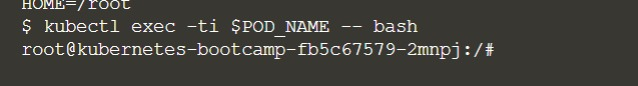

- Para ver detalles del cluster en sí se usa el comando
```
kubectl cluster-info
```

- Se puede usar el flag ```--help``` despues de un comando para obtener información adicional (por ejemplo: ```kubectl get nodes --help```)

## Exponer la app
1. Para exponer un servicio al tráfico externo utilizamos ```kubectl expose``` (por ejemplo, con el comando ```kubectl expose deployment/kubernetes-bootcamp --type="NodePort" --port 8080```)
2. Con ```kubectl describe``` podemos ver el puerto en el que está expuesto.

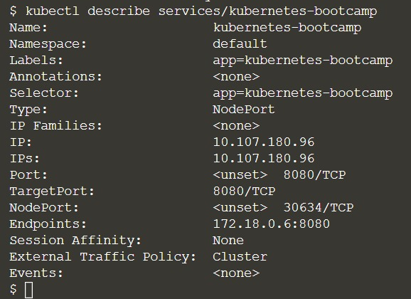

3. Podemos ver el label de un Pod con ```kubectl describe deployment``` y cambiarlo con ```kubectl describe pods $POD_NAME```

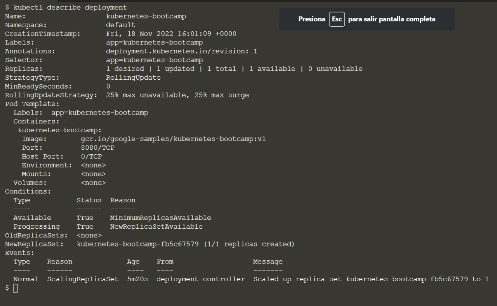

4. Para borrar un servicio expuesto se utiliza
```
kubectl delete service
```

## Escalar una aplicación
1. Teniendo ya un pod desplegado, se puede escalar con ```kubectl scale``` y el flag ```--replicas``` permite elegir la cantidad de instancias.

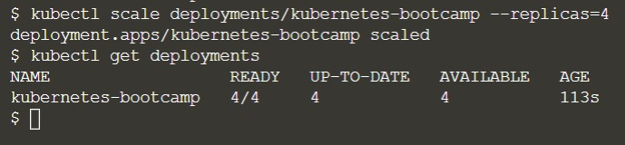

2. Sabiendo el puerto que expone el nodo, podemos revisar el load-balancing del servicio con
```
curl $(minikube ip):$NODE_PORT
```

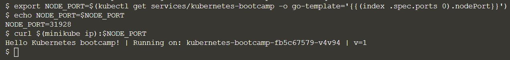

3. Para hacer un scale down, se utiliza el comando del paso 1 y se indica un numero menor de replicas en el flag.

## Actualizar una app
1. Para actualizar la imagen que se está utilizando en una aplicación utilizamos
```
kubectl set image
```


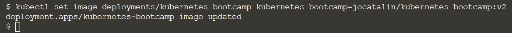

2. Con ```kubectl rollout status``` y el label de un Pod, podemos verificar si la actualización de realizó.

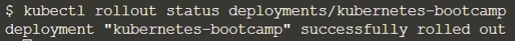

3. ```kubectl rollout undo``` revierte un Pod a su último estado conocido, efectivamente deshaciendo la última actualización.

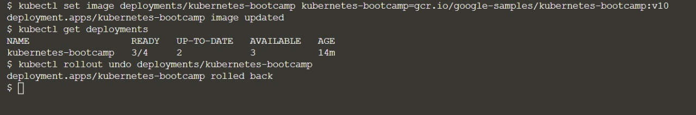