# Docker 
## Construir y ejecutar una imagen como contenedor.
1. Clonar el repositorio con 
```
git clone https://github.com/docker/getting-started.git
```
2. Crear un archivo Dockerfile en el directorio "getting-started/app"

3.  Copiar lo siguiente en el archivo Dockerfile:
```
# syntax=docker/dockerfile:1
FROM node:12-alpine
RUN apk add --no-cache python2 g++ make
WORKDIR /app
COPY . .
RUN yarn install --production
CMD ["node", "src/index.js"]
EXPOSE 3000
```

4. Desde el directorio especificado en el paso 2, crear la imagen del container con 
```
docker build -t getting-started .
```
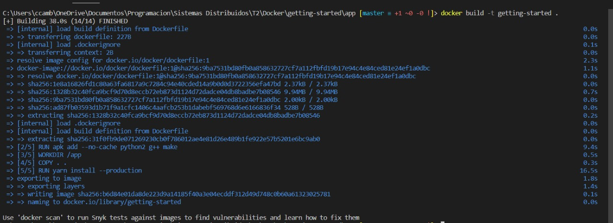
5. Con la imagen creada, correr el container con el comando 

```
docker run -dp 3000:3000 getting-started
```
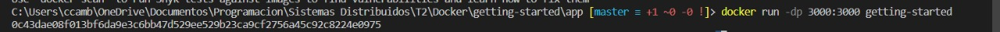
## Compartir imágenes usando Docker Hub.

6. Crear un repositorio nuevo en Dockerhub.
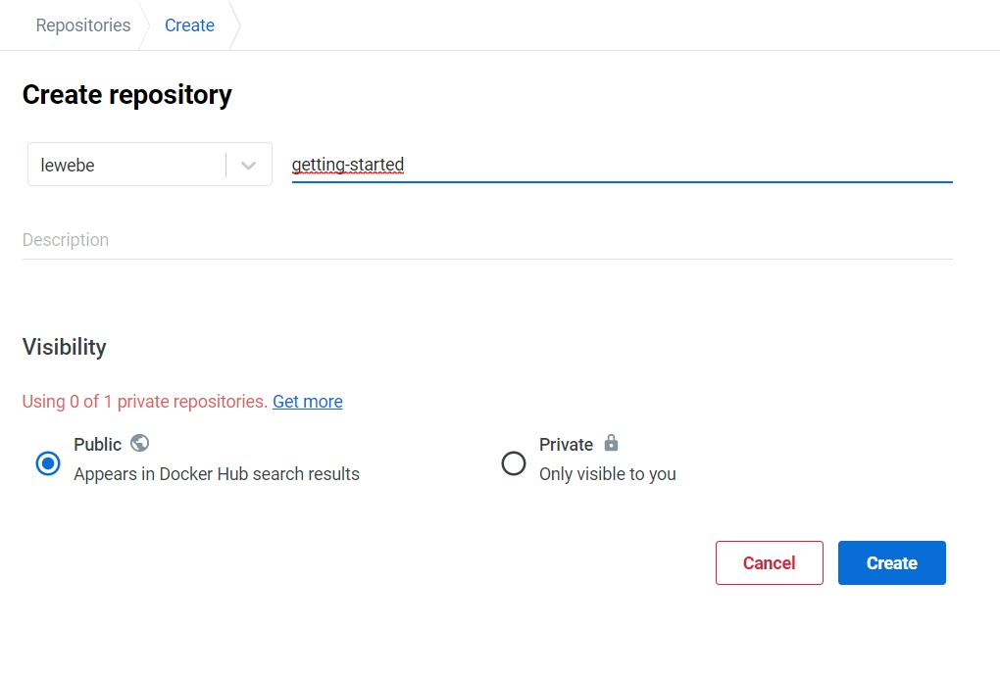

7. Crear un tag para la imagen usando el comando
```
docker tag getting-started YOUR-USER-NAME/getting-started
```

8. Hacer push de la imagen a Dockerhub con el comando

```
docker push YOUR-USER-NAME/getting-started
```
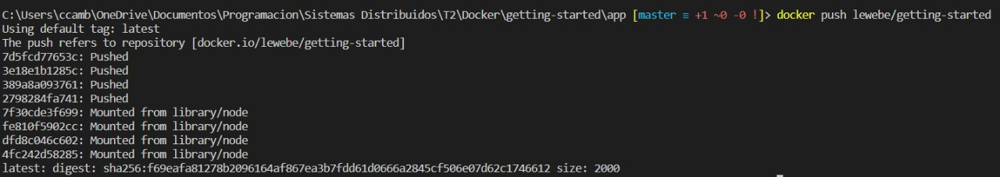

## Desplegar aplicaciones Docker utilizando m´ultiples contenedores con una base de datos.

9. Crear una network con el comando
```
docker network create todo-app
```
10. Correr el siguiente comando para asociar un container MySQL a la network (válido para Windows):
```
 PS> docker run -d `
     --network todo-app --network-alias mysql `
     -v todo-mysql-data:/var/lib/mysql `
     -e MYSQL_ROOT_PASSWORD=secret `
     -e MYSQL_DATABASE=todos `
     mysql:5.7
```
11. Revisar que efectivamente la BDD está corriendo con el comando:
```
docker exec -it <mysql-container-id> mysql -u
```
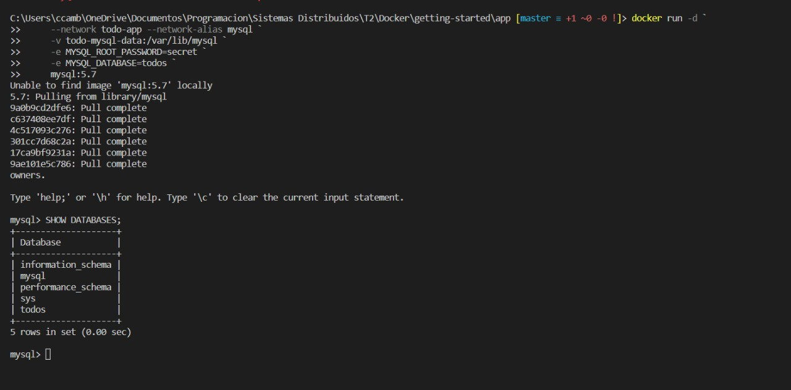
12. Correr la aplicación con el comando (válido para Windows):
```
PS> docker run -dp 3000:3000 `
   -w /app -v "$(pwd):/app" `
   --network todo-app `
   -e MYSQL_HOST=mysql `
   -e MYSQL_USER=root `
   -e MYSQL_PASSWORD=secret `
   -e MYSQL_DB=todos `
   node:12-alpine `
   sh -c "yarn install && yarn run dev"
```
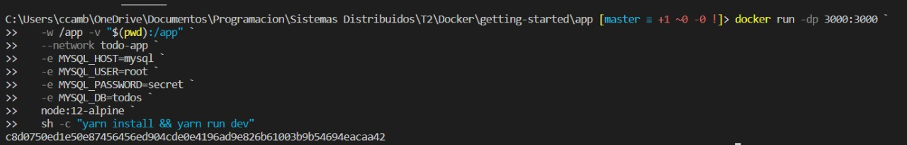
## Ejecutar aplicaciones utilizando Docker Compose.
13. Crear un archivo ```docker-compose.yml``` en la raíz del proyecto.
14. Agregar el siguiente código al archivo. Este define el servicio app que define a la aplicación principal con su respectiva imágen, comandos a correr, puertos de la network mapeados a puertos reales, el directorio donde se encuentra el Dockerfile, los volumenes y las variables de entorno:
```
version: "3.7"

services:
  app:
    image: node:12-alpine
    command: sh -c "yarn install && yarn run dev"
    ports:
      - 3000:3000
    working_dir: /app
    volumes:
      - ./:/app
    environment:
      MYSQL_HOST: mysql
      MYSQL_USER: root
      MYSQL_PASSWORD: secret
      MYSQL_DB: todos

  mysql:
    image: mysql:5.7
    volumes:
      - todo-mysql-data:/var/lib/mysql
    environment:
      MYSQL_ROOT_PASSWORD: secret
      MYSQL_DATABASE: todos

volumes:
  todo-mysql-data:
```
15. Agregar este código al ```docker-compose.yml```. Este define otro servicio, el de la base de datos, específicando la imagen, volúmen y variables de entorno:
```
  mysql:
    image: mysql:5.7
    volumes:
      - todo-mysql-data:/var/lib/mysql
    environment:
      MYSQL_ROOT_PASSWORD: secret
      MYSQL_DATABASE: todos

volumes:
  todo-mysql-data:
```
16. Finalmente, corremos la network de containers con el comando:
```
docker compose up -d
```
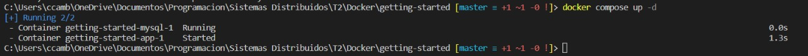

# Docker (Con aplicación de GoLang)

## Construir una imágen

1. Clonar repositorio con proyecto hecho en Go usando el comando:
 ```
git clone https://github.com/olliefr/docker-gs-ping
 ```

2. Crear un Dockerfile dentro del directorio del proyecto y agregar lo siguiente para crear un directorio, copiar los archivos, correr el programa y exponer un puerto en el container que se corra a partir de la imágen generada por este Dockerfile:
```
FROM golang:1.16-alpine

WORKDIR /app

COPY go.mod ./
COPY go.sum ./
RUN go mod download

COPY *.go ./

RUN go build -o /docker-gs-ping

EXPOSE 8080

CMD [ "/docker-gs-ping" ]
```
3. Crear la imagen a partir del Dockerfile con el comando:
```
docker build --tag docker-gs-ping
```
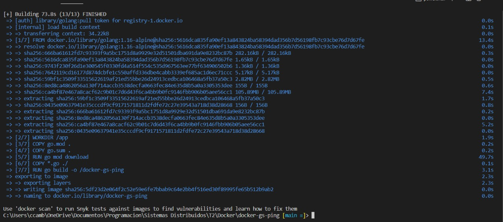
## Correr contenedor
4. Correr el siguiente comando, mapeando el puerto 8080 de la network del container al puerto 8080 de la máquina local:
```
docker run --publish 8080:8080 docker-gs-ping
```
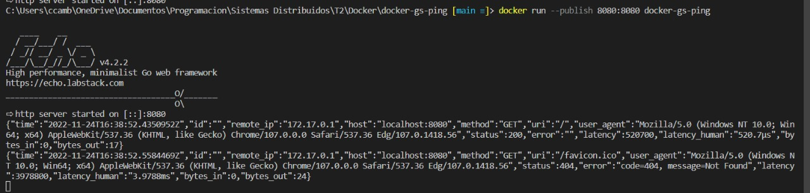
## Desarrollar la aplicación
5. Crear un volumen con:
```
docker volume create roach
```
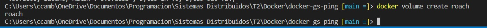
6. Crear una network en la cual la aplicación se pueda comunicar con la base de datos corriendo el comando:
```
docker network create -d bridge mynet
```
7. Correr el engine de la base de datos con el comando:
```
 docker run -d \
  --name roach \
  --hostname db \
  --network mynet \
  -p 26257:26257 \
  -p 8080:8080 \
  -v roach:/cockroach/cockroach-data \
  cockroachdb/cockroach:latest-v20.1 start-single-node \
  --insecure
```
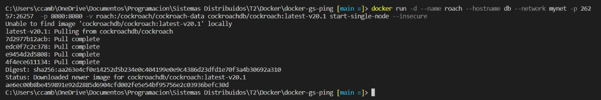
8. Configurar la base de datos. Acceder a ella con el comando:
```
docker exec -it roach ./cockroach sql --insecure
```
Luego, crear base de datos y usuario con permisos con los comandos:
```
CREATE DATABASE mydb;
CREATE USER totoro;
GRANT ALL ON DATABASE mydb TO totoro;
```
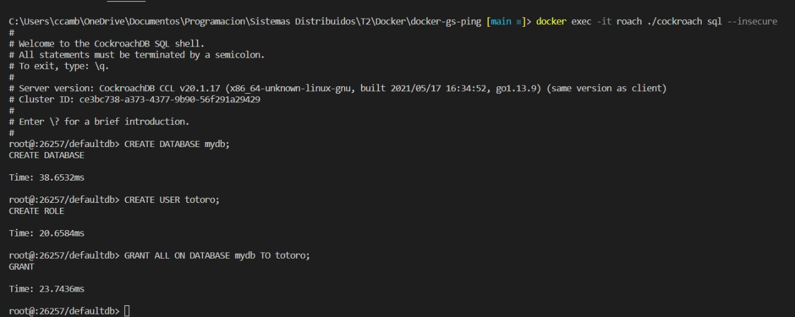
9. Correr la aplicación en si con el comando:
```
docker run -it --rm -d \
  --network mynet \
  --name rest-server \
  -p 80:8080 \
  -e PGUSER=totoro \
  -e PGPASSWORD=myfriend \
  -e PGHOST=db \
  -e PGPORT=26257 \
  -e PGDATABASE=mydb \
  docker-gs-ping-roach
```

10. Alternativamente, se puede desarrollar la aplicación y sus conexiones con Docker Compose. El siguiente archivo docker-compose.yml consigue realizar todo lo que se ha hecho hasta ahora de manera más fácil:

```
version: '3.8'

services:
  docker-gs-ping-roach:
    depends_on: 
      - roach
    build:
      context: .
    container_name: rest-server
    hostname: rest-server
    networks:
      - mynet
    ports:
      - 80:8080
    environment:
      - PGUSER=${PGUSER:-totoro}
      - PGPASSWORD=${PGPASSWORD:?database password not set}
      - PGHOST=${PGHOST:-db}
      - PGPORT=${PGPORT:-26257}
      - PGDATABASE=${PGDATABASE:-mydb}
    deploy:
      restart_policy:
        condition: on-failure
  roach:
    image: cockroachdb/cockroach:latest-v20.1
    container_name: roach
    hostname: db
    networks:
      - mynet
    ports:
      - 26257:26257
      - 8080:8080
    volumes:
      - roach:/cockroach/cockroach-data
    command: start-single-node --insecure

volumes:
  roach:

networks:
  mynet:
    driver: bridge
```

## Correr tests

11. Revisar que la imagen que se tiene del proyecto esté actualizada con:
```
docker build -t docker-gs-ping:latest .
```
12. Correr los tests con:
```
go test -v ./...
```
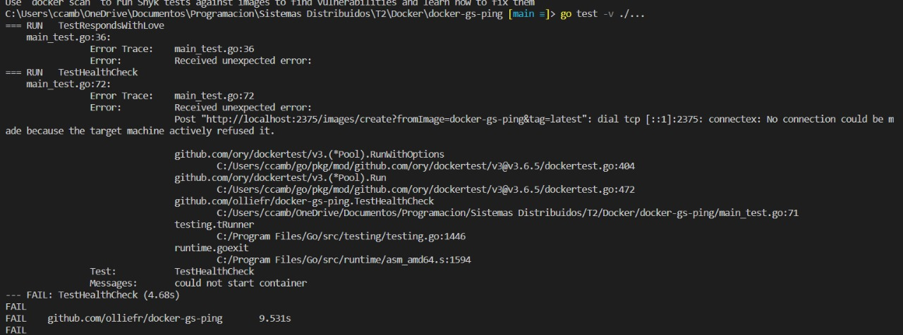
## Configurar CI/CD
13. Crear un repositorio en GitHub
14. Crear un "Secret" en el repositorio de la siguiente manera:
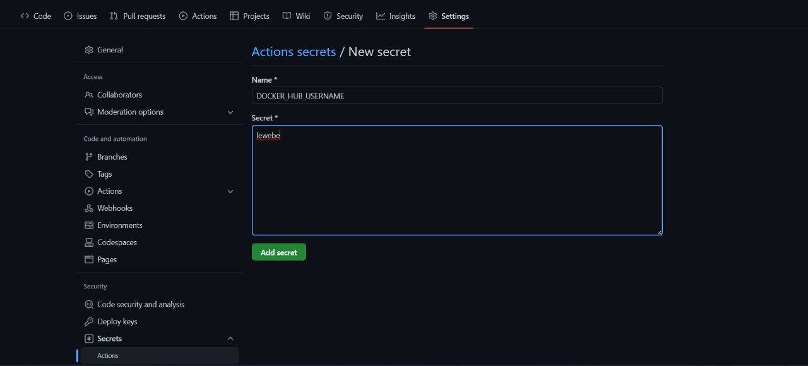
15. Configurar un Personal Access Token en DockerHub y añadirlo como Secret al repositorio de Github
16. Ir a la pestaña "Actions" del repositorio y elegir "set up a workflow yourself"
17.  Pegar lo siguiente en el editor:
```
name: ci

on:
  push:
    branches:
      - "main"

jobs:
  build:
    runs-on: ubuntu-latest
    steps:
      -
        name: Checkout
        uses: actions/checkout@v3
      -
        name: Login to Docker Hub
        uses: docker/login-action@v2
        with:
          username: ${{ secrets.DOCKER_HUB_USERNAME }}
          password: ${{ secrets.DOCKER_HUB_ACCESS_TOKEN }}
      -
        name: Set up Docker Buildx
        uses: docker/setup-buildx-action@v2
      -
        name: Build and push
        uses: docker/build-push-action@v3
        with:
          context: .
          file: ./Dockerfile
          push: true
          tags: ${{ secrets.DOCKER_HUB_USERNAME }}/clockbox:latest
```
18. Seleccionar "Start Commit"
19. En la pestaña "Actions" se puede ver el workflow configurado.
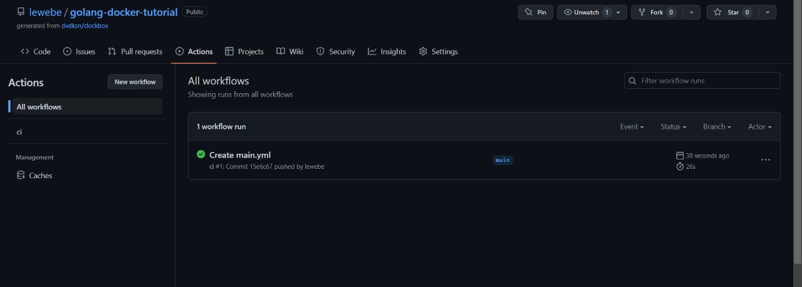

## Instrucciones generales para el deploy

- Docker permite el deploy de container en Azure ACI, AWS ECS y Kubernetes

- La integración de Docker con Azure permite  utilizar comandos nativos de Docker para ejecutar aplicaciones en Azure Container Instances (ACI) al crear aplicaciones nativas de la nube.

- La integración entre Docker y Amazon ECS permite  utilizar la CLI de Docker Compose para configurar un contexto de AWS en un solo comando de Docker, lo que permite pasar de un contexto local a un contexto en la nube y ejecutar aplicaciones de forma rápida y sencilla para simplificar el desarrollo de aplicaciones multicontenedor en Amazon ECS mediante archivos Compose.

- Docker Desktop incluye un servidor y un cliente de Kubernetes independientes, así como la integración de Docker CLI que se ejecuta en su máquina.

  Para habilitar Kubernetes:

    * En el menú de Docker, seleccionar Preferences(Configuración en Windows).
    Seleccionar Kubernetes y hacer click en Enable Kubernetes.

    * Esto inicia un clúster de un solo nodo de Kubernetes cuando se inicia Docker Desktop.